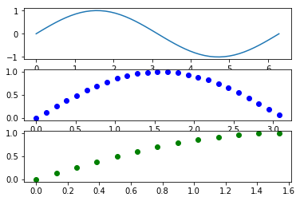

# Numpy基本语法

##数组创建


```python
import numpy as np
a1 = np.array([1,2,3,4])
a2 = np.array((1,2,3,4))
a3 = np.linspace(0,2*np.pi,5)
print(a1)
print(a2)
print(a3)
```

    [1 2 3 4]
    [1 2 3 4]
    [0.         1.57079633 3.14159265 4.71238898 6.28318531]
    


```python
#多维数组+切片操作
a = np.array([[1,2,3,4],[5,6,7,8],[9,10,11,12]])
print(a[2,3])#>>>12
print(a[0,1:3])#第0行，1到2列
print(a[::2,::2])#步长为2 行：0，2 and 列: 0,2
```

    12
    [2 3]
    [[ 1  3]
     [ 9 11]]
    

##数组的属性
- type(a): <class 'numpy.ndarray'>
- dtype
- size
- shape 
- itemsize
- ndim
- nbytes


```python
# Array properties
b = np.array([[11, 12, 13, 14, 15],
              [16, 17, 18, 19, 20],
              [21, 22, 23, 24, 25],
              [26, 27, 28 ,29, 30],
              [31, 32, 33, 34, 35]])

print(type(b)) # >>><class 'numpy.ndarray'>
print(b.dtype) # >>>int64
print(b.size) # >>>25
print(b.shape) # >>>(5, 5)
print(b.itemsize) # >>>4
print(b.ndim) # >>>2
print(b.nbytes) # >>>100 = itemsize*shape[0]*shape[1]
```

    <class 'numpy.ndarray'>
    int32
    25
    (5, 5)
    4
    2
    100
    

##数组的基本操作：基本运算
关于dot product:
>a·b=b*a^T
得到的是标量而不是数组


```python
a = np.arange(25)#[0,1,..,24]
a = a.reshape((5,5))# 5x5
b = np.array([1,2,3,4,5]*5)
b = b.reshape((5,5))
print('a:',a)
print('b:',b)
print(a+b)#5x5
print(a-b)#5x5
print(a*b)#5x5
print(a/b)#5x5
print(a**2)
print(a<b)
print(a>b)
print(a.dot(b))#a.*b
```

    a: [[ 0  1  2  3  4]
     [ 5  6  7  8  9]
     [10 11 12 13 14]
     [15 16 17 18 19]
     [20 21 22 23 24]]
    b: [[1 2 3 4 5]
     [1 2 3 4 5]
     [1 2 3 4 5]
     [1 2 3 4 5]
     [1 2 3 4 5]]
    [[ 1  3  5  7  9]
     [ 6  8 10 12 14]
     [11 13 15 17 19]
     [16 18 20 22 24]
     [21 23 25 27 29]]
    [[-1 -1 -1 -1 -1]
     [ 4  4  4  4  4]
     [ 9  9  9  9  9]
     [14 14 14 14 14]
     [19 19 19 19 19]]
    [[  0   2   6  12  20]
     [  5  12  21  32  45]
     [ 10  22  36  52  70]
     [ 15  32  51  72  95]
     [ 20  42  66  92 120]]
    [[ 0.          0.5         0.66666667  0.75        0.8       ]
     [ 5.          3.          2.33333333  2.          1.8       ]
     [10.          5.5         4.          3.25        2.8       ]
     [15.          8.          5.66666667  4.5         3.8       ]
     [20.         10.5         7.33333333  5.75        4.8       ]]
    [[  0   1   4   9  16]
     [ 25  36  49  64  81]
     [100 121 144 169 196]
     [225 256 289 324 361]
     [400 441 484 529 576]]
    [[ True  True  True  True  True]
     [False False False False False]
     [False False False False False]
     [False False False False False]
     [False False False False False]]
    [[False False False False False]
     [ True  True  True  True  True]
     [ True  True  True  True  True]
     [ True  True  True  True  True]
     [ True  True  True  True  True]]
    [[ 10  20  30  40  50]
     [ 35  70 105 140 175]
     [ 60 120 180 240 300]
     [ 85 170 255 340 425]
     [110 220 330 440 550]]
    

##Boolean masking


```python
%matplotlib inline
import matplotlib.pyplot as plt

a = np.linspace(0, 2 * np.pi, 50)
b = np.sin(a)
plt.subplot(3,1,1)
plt.plot(a,b)
mask = b >= 0
plt.subplot(3,1,2)
plt.plot(a[mask], b[mask], 'bo')
plt.subplot(3,1,3)
mask = (b >= 0) & (a <= np.pi / 2)
plt.plot(a[mask], b[mask], 'go')
plt.show()
```





>numpy.where()分为两种调用方式
- np.where(cnd,x,y) 满足条件(cond)输出x，不满足输出y
- np.where(array) 输出array中'x'值的坐标


```python
#where func:返回的是下标列表
a = np.arange(0,100,10)
print(a)
print(np.where(a<50))
print(np.where(a>=50)[-1])

np.where([[True,False],[True,True]],#cond
        [[1111,2222],[3333,4444]],#x
        [[9999,8888],[7777,6666]])#y
```

    [ 0 10 20 30 40 50 60 70 80 90]
    (array([0, 1, 2, 3, 4], dtype=int64),)
    [5 6 7 8 9]
    


    array([[1111, 8888],
           [3333, 4444]])


